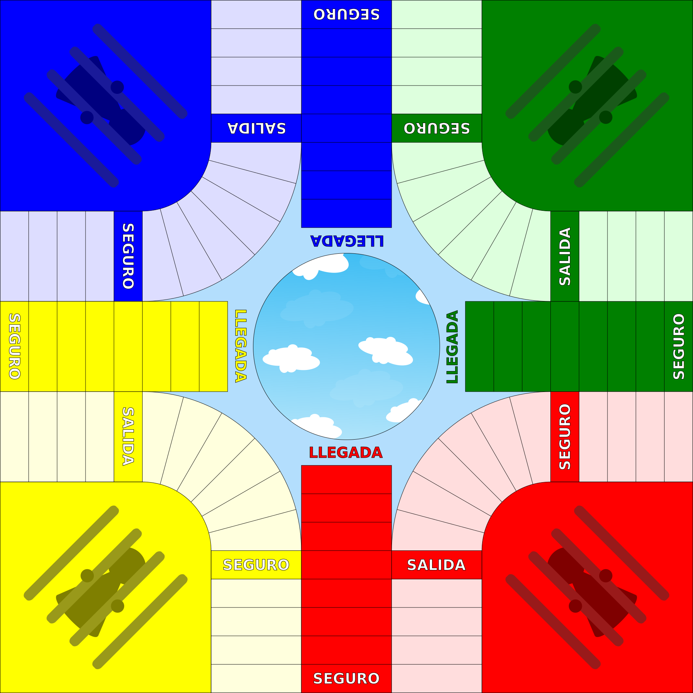

# Parqués Board Game

# Introduction
Parqués is a Colombian board game that is similar to Pachisi, Parcheesi, or Ludo. Despite similarities, the game is widely agreed to originate from Colombian culture. Many local variations of Parqués exist in Colombia. This variation is based on rules commonly used in Medellín.

# Winning Conditions
The objective is to move all four of your pieces to the center space of the board. The center marks the end of the board.

Once a piece reaches the center, the piece is removed from the board. The winning player will not have any pieces on the board.

# Board and Equipment
A four-player board is used. Each player is assigned a respective color and corner (red, blue, yellow, or green). The color identifies the player's unique pieces, their 'jail', their 'exit', and their 'home'.

'Safe Spaces' are also marked by player colors, but they can be used by any player. Pieces in safe spaces cannot be captured by other players (Rule 3 under Actions).

'Jails' are the starting space for each respective player.

'Exits' are safe spaces where pieces leave jail. However, another player's piece on your specific exit returns to jail when your pieces are freed (Rule 4 under Actions).

'Homes' are marked by seven color-coded safe spaces before the center. Players must pass their pieces through their home to reach the center. Only pieces of the matching color can use these. The bottom safe space is not considered part of home (it is labeled "seguro" or safe space on the board).

The Board Diagram:

Credit: By Germarquezm - Own work, CC BY-SA 3.0, https://commons.wikimedia.org/w/index.php?curid=31178664

Fun Fact: Classic Parqués boards are glass, which is better for dice throwing. I have an old wooden one.

**Note that "salida" is exit and "seguro" is a safe spot in Spanish**

# Actions

## Quick Summary of Rules
**Double: Rolling the same number on both dice**

**Capture: Returning another player's piece to jail.**

Rule 1.) Roll up to three times per turn if all your pieces are in jail until rolling a double.

Rule 2.) Rolling a double gives you another roll in the same turn.

Rule 3.) Landing on another player's piece if they are not on a safe space captures it.

Rule 4.) If the owner of an exit frees their pieces from jail, any opposing player's pieces on the exit are captured.

Rule 5.) Rolling three doubles in one turn sends your farthest piece to jail, regardless of any safe spaces or home.

Rule 6.) If you do not capture another piece when possible and the next player has not rolled yet, other players can call you, which would send the piece (that could have captured the opposing player's piece) to jail. If multiple pieces could of captured an opposing player's pieces, you pick which one to send to jail.

Rule 7.) If you have one piece left on the board (in home) and it is within six spaces of the center space, use one die for the rest of the game.

## Start
Player turn order starts with ‘red’, followed by ‘blue’, ‘yellow’, and then ‘green’.

Each player will start with their four pieces in their respective jails. Players will roll two dice at a time. Players will start by trying to get their pieces out of jail.

## Getting Pieces out of Jail
Since players have all their pieces in jail, players will roll up to three times per turn until they get a double (Rule #1).

Roll a double to free your pieces:

A double six or a double one will allow you to move up to four of your pieces from your jail to your exit.
If you roll any other double, you can move up to two pieces to the exit.
With any double, you can also move only one piece out of jail and move a free piece forward by the number on a single die (1-6).

Once players move their pieces out of jail, they will roll again on the same turn (Rule #2). Any pieces from a different player on the active player's exit will be captured if the active player moves their pieces out of jail (Rule #4).

## Moving Pieces
On each turn, you roll two dice. You can move up to two pieces on their turn:

You may move one free piece by the number on the first die and another piece by the number on the second die (Ex: moving one piece 4 spaces and the other 5 spaces if the dice roll is 4 and 5). You can alternatively move a single piece by the combined total of both dice (Ex: moving one piece 9 spaces for a roll of 4 and 5). 

However, you cannot split the movement from a single die across multiple pieces. If the dice roll is 4 and 5, they cannot move two pieces 4 spaces each.

If you roll a double, you can move and roll again in the same turn (Rule #2). Three doubles in a row in a single turn will cause your farthest piece to go to jail (Rule #5). 

If a player is approaching their home at the end of the board, they may choose to move their piece into their home or continue moving around the board again.

## Capturing Other Pieces
If a player's piece lands on another player's piece outside of a safe space, the first player must capture the second player's piece (Rule #3). 

However, if you decide not to capture another player's piece, other players may call you out before the next player starts, which would send your piece in question to jail (Rule #6). A player may be called out if their piece is approaching their home but still has the option of continuing around the board again and capturing another piece. This opens up another strategy of baiting.

## End Game
Pieces must enter home before moving to the center. Once your piece reaches home, you must get an exact dice roll to land on the center. You can still move if you roll less than the exact amount with at least one die. Once that piece lands on the center space, you remove that piece from the board.

If you have multiple pieces left on the board and your only free piece(s) are close to the center, you may roll a total you cannot move. You may move by only the number on one of the dice. If you cannot move, your turn ends.

On the other hand, if your last piece is within six spaces of the center space, you must finish the game with only one die (Rule #7). 
